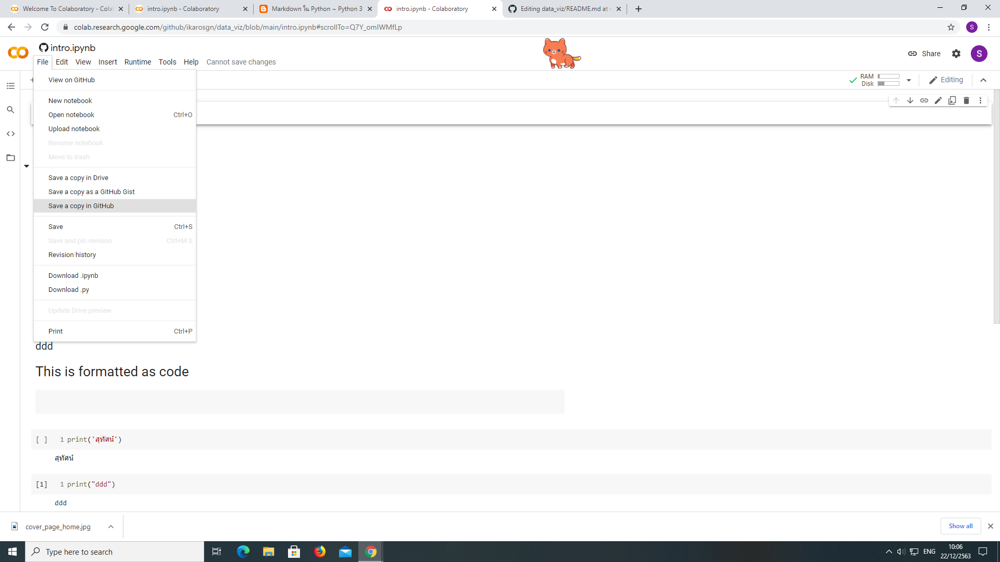
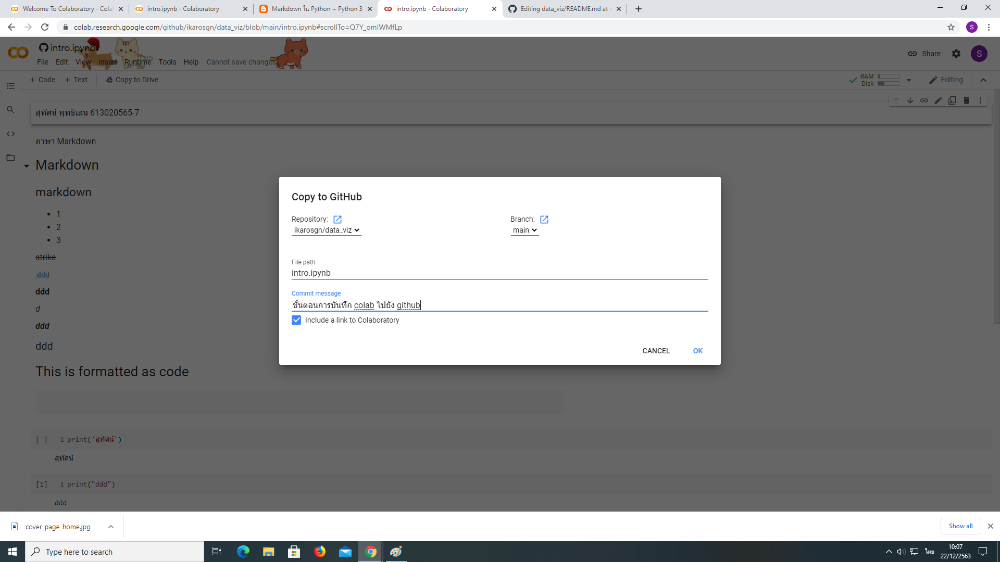
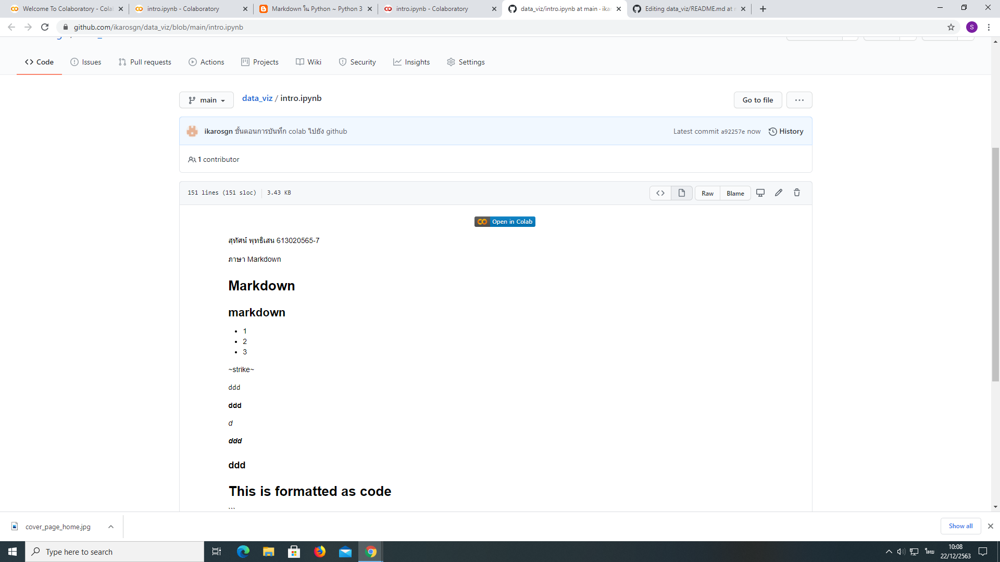

# data_viz

สุทัศน์ พุทธิเสน 613020565-7

ตัวอย่างการแทรกรูป

ขั้นตอนการบันทึก colab ไปยัง github

1.กดที่แถบเมนูคลิกที่ "file" 
2.จากนั้นกดที่ "Save a copy in Github"

3.ตั้งชื่อ commit message 
4.กด "Ok"

5.เสร็จสิ้น

